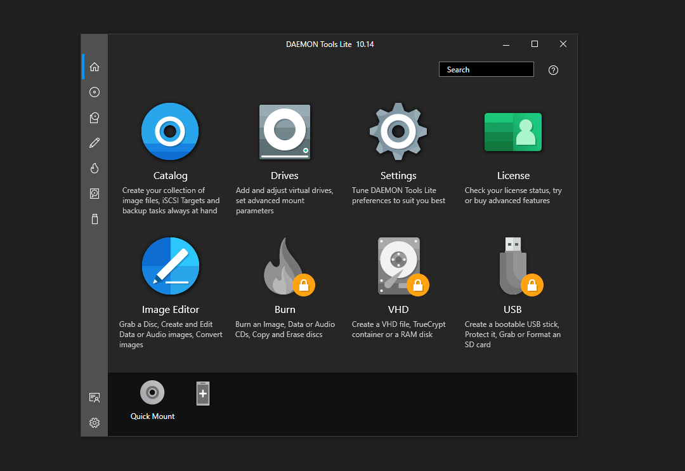

# DAEMON_Patcher
[DAEMON Tools Lite](https://www.daemon-tools.cc/products/dtLite) Patcher/Unlocker

## Features
- Automatically detect directory
- Automatically patch file

## Build
```SH
git clone https://github.com/Mrakovic-ORG/DAEMON_Patcher
cd DAEMON_Patcher\src
nuget restore
dotnet build
```

## Demo


## Disclaimer
This project has been made for educational purpose, Cracking/Deobfuscating/Un-protecting a licensed software is illegal, This project does not deobfuscate/un-protect the software.

## Credits
[0xd4d](https://github.com/0xd4d) for the awesome work he brings to .NET developers.

License
----

MIT